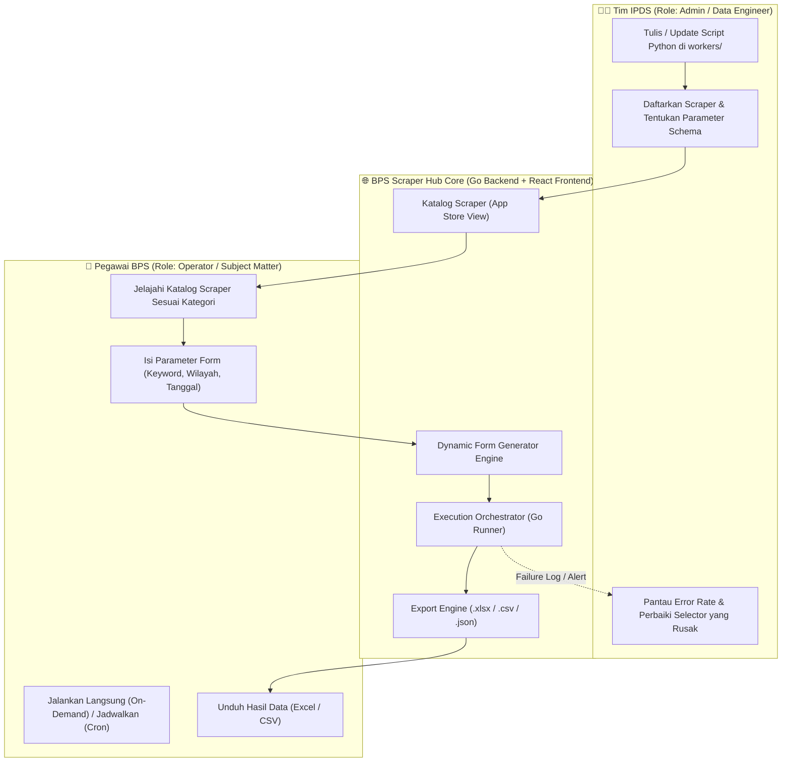
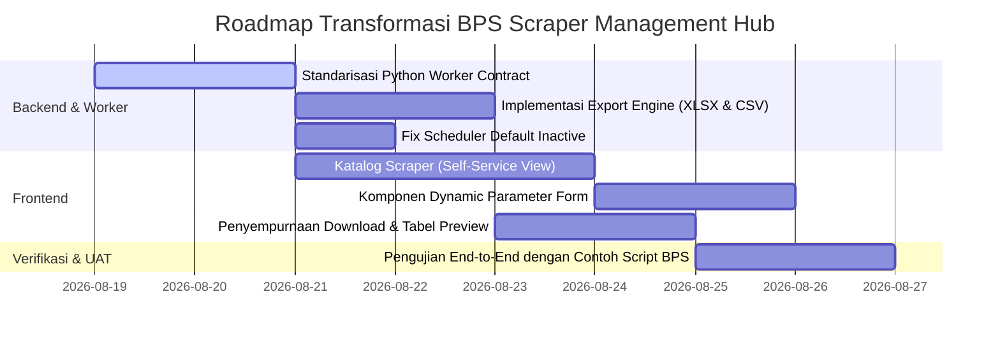

# Arsitektur & Transformasi Sistem: BPS Scraper Management Hub

Dokumen ini mendokumentasikan spesifikasi, perubahan paradigma, dan arsitektur teknis transformasi proyek dari sekadar *tool scheduling scraper kaku* menjadi **Internal Scraper Hub / Scraper-as-a-Service Portal** yang dirancang khusus untuk kebutuhan Badan Pusat Statistik (BPS).

---

## 1. Latar Belakang & Transformasi Paradigma

### 1.1 Masalah di Lingkungan BPS
- **Kebutuhan Data Seksi Teknis (Distribusi, Sosial, Nerwilis, Produksi, dll.)**: Sering membutuhkan data eksternal (harga komoditas pasar, data e-commerce, portal pemda/SIPD, berita inflasi daerah), namun pegawai teknis tidak memiliki keahlian teknis/koding Python untuk melakukan web scraping mandiri.
- **Beban Tim IPDS (Integrasi Pengolahan & Diseminasi Statistik)**: Menjadi tumpuan pembuatan script secara ad-hoc, manual, dan sering kali script yang dibuat tersebar di berbagai laptop tanpa pengelolaan versi dan governance terpusat.

### 1.2 Konsep Baru: Scraper Management & Execution Hub
Proyek ini bertransformasi menjadi platform kolaborasi dua arah:
1. **IPDS sebagai Provider**: Mengembangkan script/metode scraping modular, mendaftarkannya ke sistem, mendefinisikan skema parameter input yang ramah pengguna, serta memelihara script saat web target berubah struktur (*broken selector*).
2. **Pegawai Umum BPS sebagai Consumer**: Membuka katalog scraper, memilih scraper yang dibutuhkan, mengisi filter/parameter via form otomatis (tanpa koding), menjalankan on-demand atau terjadwal, dan langsung mengunduh hasil data bersih dalam format **Excel (XLSX)** atau **CSV**.

---

## 2. Matriks Peran & Hak Akses (Role-Based Access Control)



| Fitur / Kemampuan | Tim IPDS (`admin`) | Pegawai BPS (`operator`) |
| :--- | :---: | :---: |
| **Katalog Scraper** | Kelola & Publikasikan Scraper | Jelajahi & Gunakan Scraper |
| **Form Parameter** | Rancang Skema Input (JSON Schema) | Isi Form Dinamis Sederhana |
| **Eksekusi Script** | Eksekusi, Debugging & Test Run | Eksekusi On-Demand & Terjadwal |
| **Download Data** | Unduh XLSX / CSV / JSON | Unduh XLSX / CSV / JSON |
| **Script Management** | Upload / Daftarkan Script Baru | Tidak Memerlukan Koding |
| **Monitoring & Logs** | Full System & Worker Log Trace | Ringkasan Status & Pesan Error |

---

## 3. Standarisasi Kontrak Worker Python (Standard I/O Contract)

Agar script scraping apa pun yang dibuat oleh tim IPDS dapat langsung berjalan di platform tanpa perlu mengubah kode backend Golang, setiap script wajib mematuhi **Kontrak I/O Standar**.

### 3.1 Format Input (Execution Argument)
Go Backend memanggil worker Python melalui CLI dengan payload JSON string:
```bash
python workers/python/worker.py <nama_file_scraper.py> '<json_payload>'
```

Struktur `<json_payload>` yang diterima script:
```json
{
  "url": "https://pasar.kemendag.go.id/...",
  "keyword": "Beras Premium",
  "province_code": "71",
  "start_date": "2026-08-01",
  "end_date": "2026-08-18",
  "max_results": 50
}
```

### 3.2 Format Output (Stdout JSON Contract)
Worker wajib mengeluarkan output JSON bersih ke `stdout` dengan struktur berikut:
```json
{
  "status": "success",
  "method": "kemendag_pasar_scraper",
  "results": [
    {
      "tanggal": "2026-08-18",
      "komoditas": "Beras Premium",
      "satuan": "Kg",
      "harga": 15500,
      "pasar": "Pasar Bersehati Manado"
    }
  ],
  "metadata": {
    "source": "kemendag_pasar_scraper",
    "fetched_at": "2026-08-18T19:00:00Z",
    "item_count": 1,
    "execution_time_seconds": 1.45
  },
  "error": null
}
```
*Jika terjadi kegagalan/error:*
```json
{
  "status": "failed",
  "method": "kemendag_pasar_scraper",
  "results": [],
  "metadata": {
    "source": "kemendag_pasar_scraper",
    "fetched_at": "2026-08-18T19:00:00Z",
    "item_count": 0
  },
  "error": "HTTP 403: Cloudflare protection triggered or selector updated"
}
```

---

## 4. Skema Dynamic Parameter (Blueprint Form Generator)

Setiap scraper yang didaftarkan IPDS memiliki metadata parameter yang otomatis di-render oleh Frontend menjadi form interaktif yang ramah pengguna.

### Contoh Definisi Skema Parameter:
```json
[
  {
    "name": "keyword",
    "label": "Kata Kunci Komoditas / Isu",
    "type": "text",
    "required": true,
    "placeholder": "Contoh: Cabai Rawit Merah",
    "default_value": "Beras Medium"
  },
  {
    "name": "region",
    "label": "Wilayah Kabupaten/Kota",
    "type": "select",
    "required": true,
    "options": [
      { "label": "Semua Wilayah", "value": "ALL" },
      { "label": "Kota Manado", "value": "7171" },
      { "label": "Kab. Minahasa", "value": "7102" }
    ],
    "default_value": "7171"
  },
  {
    "name": "date_range",
    "label": "Rentang Tanggal Pengambilan",
    "type": "daterange",
    "required": false
  },
  {
    "name": "max_records",
    "label": "Batas Maksimal Data",
    "type": "number",
    "required": false,
    "default_value": 100
  }
]
```

### Tipe Kontrol UI yang Didukung:
- `text`: Input teks biasa (query, kata kunci, url).
- `number`: Input angka batas atau paginasi.
- `select`: Dropdown pilihan (wilayah, kategori, status).
- `daterange`: Datepicker tanggal awal dan akhir.
- `checkbox` / `boolean`: Switch opsi (misal: "Sertakan artikel opini").

---

## 5. Rencana Penyesuaian Komponen Sistem

### 5.1 Backend (Golang)
1. **Dynamic Method Registry**:
   - Memastikan registry scraper dapat membaca metadata dari DB atau modul registry secara dinamis.
2. **Export Engine (XLSX & CSV)**:
   - Endpoint `GET /jobs/:id/download?format=xlsx` dan `GET /jobs/:id/download?format=csv` untuk menghasilkan spreadsheet tabular otomatis dari array JSON `results`.
3. **Scheduler Default Safety**:
   - Memastikan pembuatan schedule baru default dalam kondisi `status: inactive` (sesuai catatan evaluasi).

### 5.2 Frontend (React 19 + Tailwind CSS)
1. **Halaman Katalog Scraper (`/scrapers` / `/katalog`)**:
   - Tampilan visual ala App Store / Card Grid dengan filter kategori (Harga Pasar, Sosial, Nerwilis, Berita Daerah).
   - Tombol cepat: "Gunakan Scraper Ini" langsung mengarahkan ke form dynamic.
2. **Dynamic Form Component (`ScraperRunnerForm.tsx`)**:
   - Komponen generik yang menerima schema parameter dan merender input control yang sesuai secara otomatis.
3. **Download Center di Halaman Hasil Job (`JobDetailPage.tsx`)**:
   - Tombol aksi jelas: **Download Excel (.xlsx)** dan **Download CSV (.csv)** dengan pratinjau tabel interaktif.
4. **Halaman Manajemen Scraper Khusus IPDS (`/admin/methods`)**:
   - Form pendaftaran script scraper baru, pengaturan schema parameter, dan uji coba runner.

---

## 6. Tahapan Eksekusi / Roadmap



---

## 7. Kesimpulan

Dengan transformasi ini, sistem menjadi **solusi terpadu dan berkelanjutan**:
- Pegawai BPS dipermudah dalam memperoleh data pendukung statistik tanpa kendala teknis.
- Tim IPDS memiliki wadah terstruktur untuk mempublikasikan dan merawat script scraping.
- Seluruh histori pengambilan data dan log audit tersimpan aman dan terkelola secara institusional.
